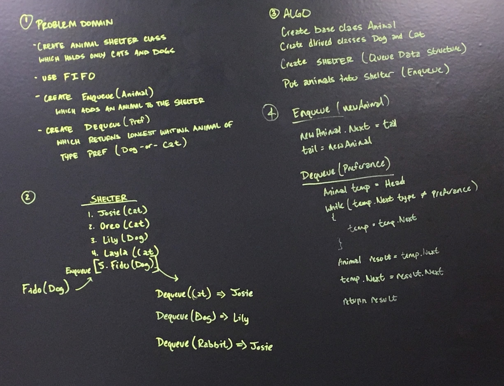

# Animal Shelter

This challenge is a exercise in manipulating linear data structures.
A "FIFO" (first-in-first-out) data structure is used to Emulate an Animal Adoption Shelter,
where the first Animals placed into the shelter are prioritized for retrieval.

## Challenge

Implement the following methods for the AnimalShelter class:

Enqueue(Animal) which inserts an Animal object into the Shelter using a first-in, first-out approach.

Dequeue(Preferance) which extracts an Animal with the preferred type from the Shelter using a first-in, first-out approach.
	If a matching preferance does not exist, the current first-in Animal is returned.

## Solution

