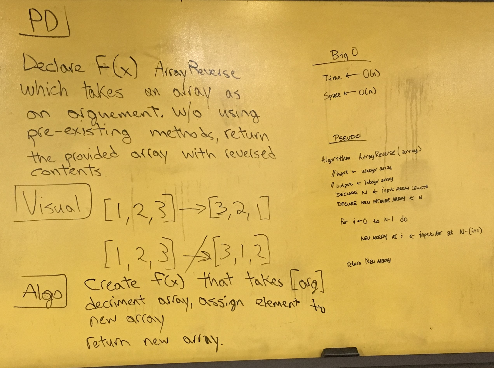

# Reverse an Array

## Summary of Challenge

Write a function called ArrayReverse() which takes an array as an argument.
Withouth utilizing any of the built-in methods available to your language, return
the provided array argument with elements in reversed order.

## Image

## Explanation

