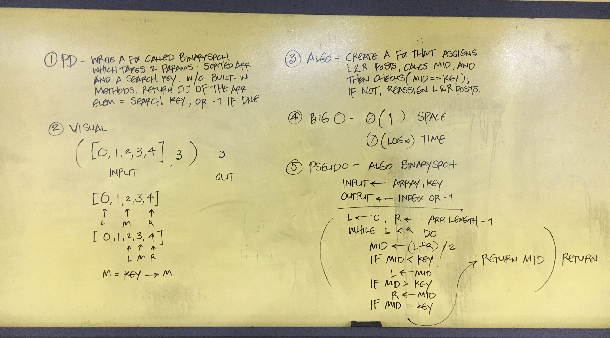

# Binary Search Through Array

## Challenge

Write a function called BinarySearch which takes in 2 parameters: a sorted array and the search key. 
Without utilizing any of the built-in methods available to your language, return the index of the array’s 
element that is equal to the search key, or -1 if the element does not exist.

## Whiteboard



## Code
```C#
        static int BinarySearch(int[] arr, int key)
        {
            int left = 0; //Delcare left post index
            int right = arr.Length - 1; //Declare right post index

            while (left <= right)
            {
                int middle = (left + right) / 2; //Declare middle value index
                if (arr[middle] == key) //Evaluate middle value
                    return middle; //Return Index

                if (arr[middle] > key)
                    right = middle - 1; //Reassign right post

                if (arr[middle] < key)
                    left = middle + 1; //Reassign left post
            }
            return -1; //Return -1 if not found
        }
```
