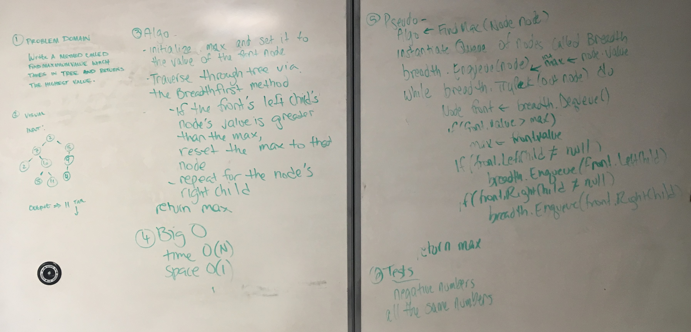

# Find Max Value in a Binary Tree

This challenge is an exersize in utiling binary trees. Inside, a binary tree is used to traverse
though Nodes and return the largest value of all included nodes.

## Challenge

Write a function called find-maximum-value which takes binary tree as its only imput.

Without utilizing any of the built-in methods available to your language, 

return the maximum value stored in the tree. You can assume that the values stored 

in the Binary Tree will be numeric.

## Solution

