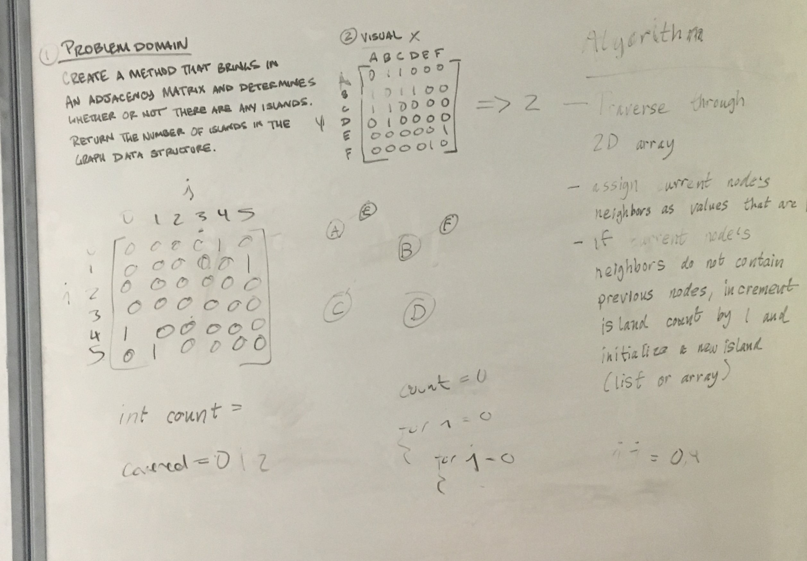

# Find Islands

This challenge is an exercise in manipulating graphs via Adjacency Matrices

## Challenge

Create a function that brings in an adjacency matrix and determines whether or not there 
are any islands. Without utilizing any of the built-in methods available to your language,
return the number of islands present in the graph data structure.

## Whiteboard



## Code
```C#
        /// <summary>
        /// FindIslands - Method takes a two dimentional Array which represents an Adjacency Matrix and returns the number 
        /// of "islands" it contains (isolated groups of connected elements).
        /// </summary>
        /// <param graphMatrix> int[,] - Two dimensional matrix representing connections between graph elements </param>
        /// <returns>  int - number of seperated "islands" </returns>
        public static int FindIslands(int[,] graphMatrix)
        {
            int islandCounter = 0;
            List<int> searchedNodes = new List<int>();

            for (int i = 0; i < graphMatrix.GetLength(0); i++)
            {
                bool nodeIsIsland = true;

                for (int j = 0; j < graphMatrix.GetLength(1); j++)
                {
                    if (graphMatrix[i, j] > 0)
                    {
                        nodeIsIsland = false;

                        if (!searchedNodes.Contains(j))
                        {
                            searchedNodes.Add(j);
                            islandCounter++;
                        }
                        break;
                    }
                }

                if (nodeIsIsland)
                    islandCounter++;

                searchedNodes.Add(i);
            }

            return islandCounter;
        }
```
