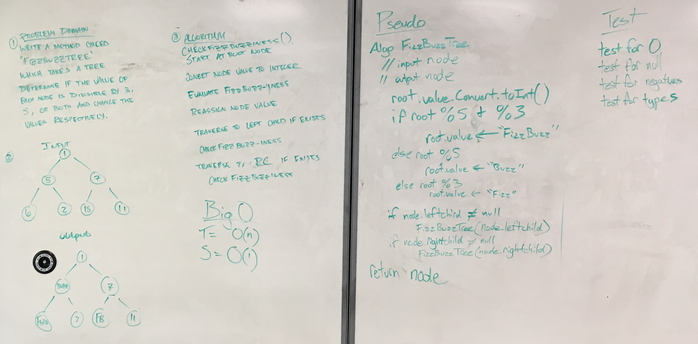

# FizzBuzzTree

This challenge is an exersize in utiling binary trees. Inside, a binary tree is used to traverse
though Nodes and change their values based on the rules of the FizzBuzz game.

## Challenge

Write a function called FizzBuzzTree which takes a tree as an argument.

Without utilizing any of the built-in methods available to your language, 

determine weather or not the value of each node is divisible by 3, 5 or both,

and change the value of each of the nodes respectively.

Return the tree with it’s news values.

## Whiteboard



## Code
```C#
        /// <summary>
        /// FizzBuzzTree - Changes Node values within the tree based on traditional FizzBuzz rules.
        /// </summary>
        /// <param name="root"> Node - Root Node of Binary Tree </param>
        /// <returns> Node - input Root Node </returns>
        public Node FizzBuzzTree(Node root)
        {
            int number;
            bool isNum = Int32.TryParse(root.Value, out number);

            if (isNum && number != 0)
            {
                if (number % 15 == 0)
                    root.Value = "FizzBuzz";
                else if (number % 5 == 0)
                    root.Value = "Buzz";
                else if (number % 3 == 0)
                    root.Value = "Fizz";
            }

            if (root.LeftChild != null)
                FizzBuzzTree(root.LeftChild);

            if (root.RightChild != null)
                FizzBuzzTree(root.RightChild);

            return root;
        }
```
