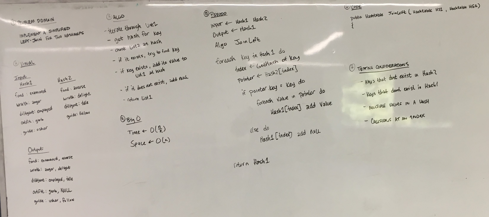

# Left Join

This challenge is an exercise in utilizing Hashtables and Hashsets to hash and
store data in an efficient way.

## Challenge

Write a function that left joins two hashmaps into a single data structure.
LEFT JOIN means all the values in the first hashmap are returned, and if values 
exist in the “right” hashtable, they are appended to the result row. If no values exist 
in the right hashtable, then some flavor of NULL should be appended to the result row.

## Solution

