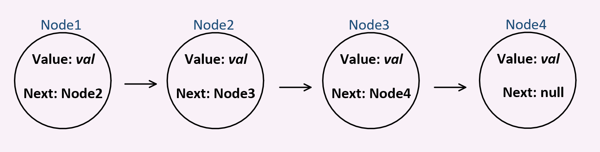
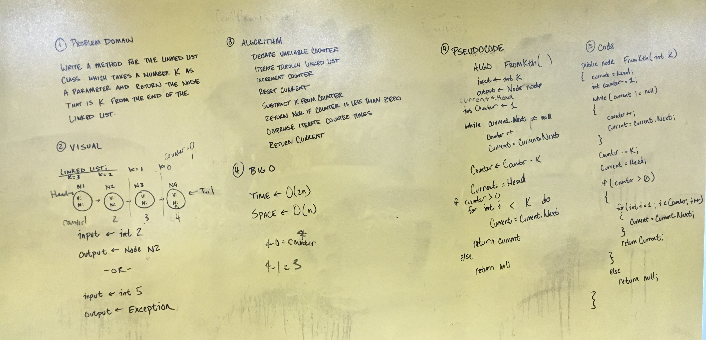

# Linked Lists

## Summary

This project is a exercise in the implementation of the Linked List data structure.
Linked Lists are a linear data type, and can be used in a similar way as Arrays.
Unlike Arrays, Linked Lists allow for more dynamic uses such as adding, inserting, and deleting.
Also unlike Arrays, random access is not possible with Linked Lists. All elements must be accessed
sequentially, making implementation a case-by-case decision.

## Visual

## Implementation

This project is implemented with multiple classes. One class represents a Linked List object,
another class represents a Node object. Both classes have properties, and the Linked List class
contains several methods for manipulating nodes within the list.

## Usage

Linked lists are best implemented when data-set size is variable and insertion/deletion operation are frequently used.
Linked list are best avoided when sorting and when random access are common required operations.

# Kth Element From the End of the Linked List

This method is an exercise in manipulating linked lists. 
It returns the element that is k elements from the last element.

## Challange

Write a method for the Linked List class which takes a number, k, as a parameter.
Return the node that is k from the end of the linked list. You have access to the Node class and 
all the properties on the Linked List class as well as the methods created in previous challenges. ​

## Solution

