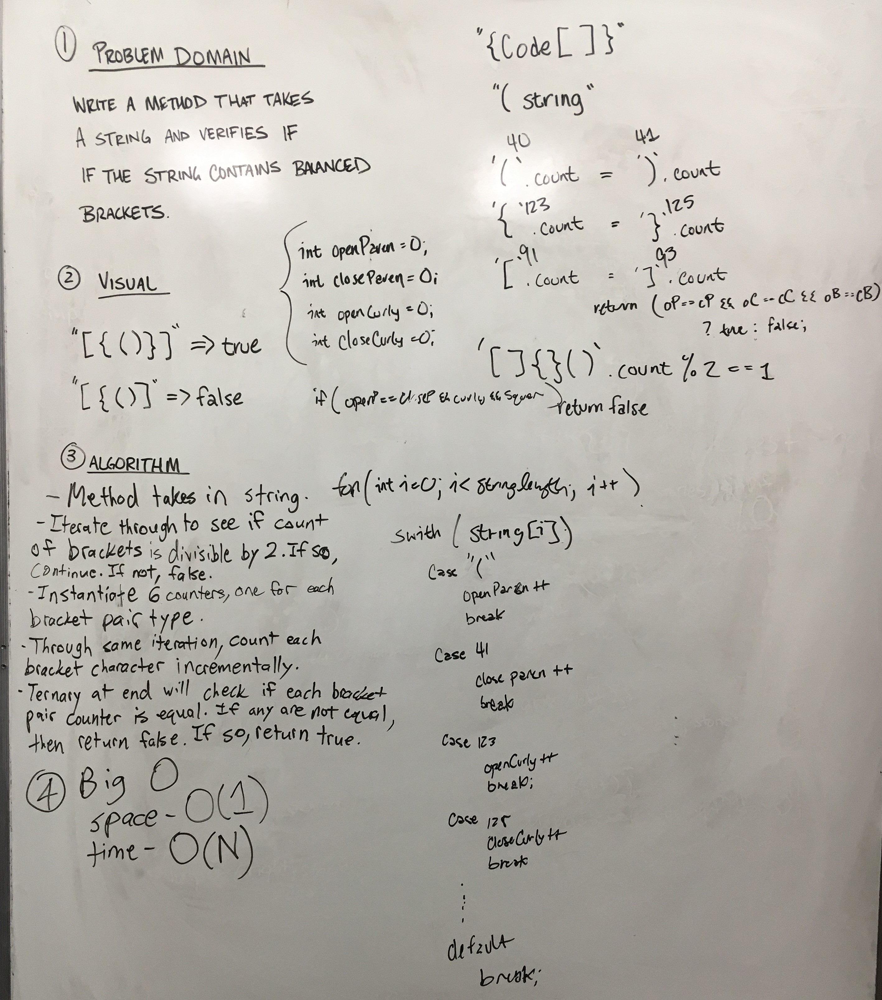

# Multi Bracket Validation

This challenge is an exercise in manipulating linear data structures.
Bracket validation is implemented using a Stack to contain all unmatched bracket characters.

## Challenge

Your function should take a string as its only argument, and should return a boolean representing 
whether or not the brackets in the string are balanced. There are 3 types of brackets:

Round Brackets : ()

Square Brackets : []

Curly Brackets : {}

## Whiteboard



## Code
```C#
        /// <summary>
        /// MultiBracketValidation - Verifies if input string contains validly formatted bracketing.
        /// </summary>
        /// <param name="input"> string - Input to be validated for bracketing </param>
        /// <returns>bool - True if valid, false if not. </returns>
        public static bool MultiBracketValidation(string input)
        {
            string validChars = "(){}[]";

            Stack myStack = new Stack();

            foreach (char c in input)
            {
                if (validChars.Contains(c))
                {
                    if (myStack.Top == null)
                    {
                        myStack.Push(new Node(c));
                    }
                    else if (CompareBrackets(myStack.Top.Value, c))
                    {
                        myStack.Pop();
                    }
                    else
                    {
                        myStack.Push(new Node(c));
                    }
                }
            }
            return (myStack.Top == null) ? true : false;
        }
```
