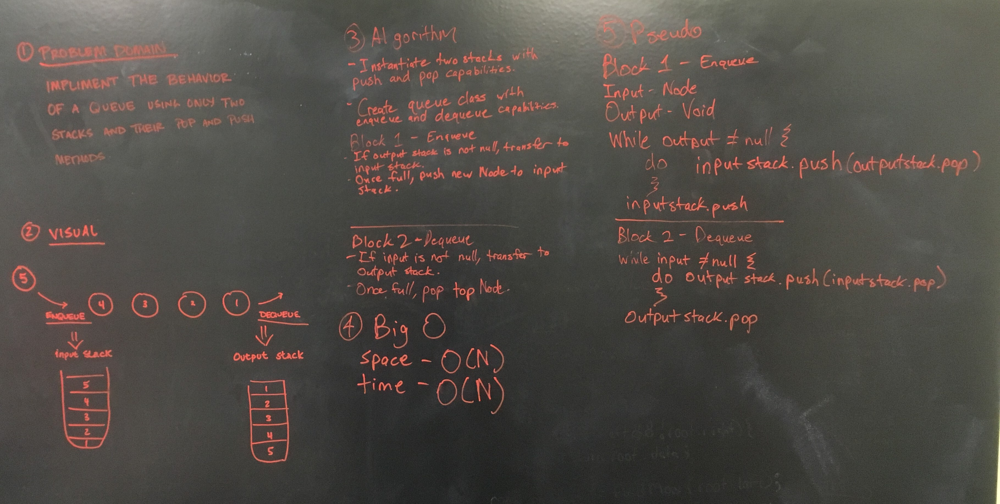

# Queue With Two Stacks

This challenge is a exercise in manipulating linear data structures.
Both "FIFO" (first-in-first-out) and "LIFO" (last-in-first-out) structures are used to impliment
a scalable data collection.

## Challenge

Implement the following methods for the Queue class:

enqueue(value) which inserts value into the Queue using a first-in, first-out approach.

dequeue() which extracts a value from the Queue using a first-in, first-out approach.

You have access to 2 Stack instances with push and pop methods.

## Whiteboard



## Code
```C#
 public class Queue
    {
        public Stack inputStack { get; set; }
        public Stack outputStack { get; set; }


        //Constructors
        public Queue()
        {
            inputStack = new Stack();
            outputStack = new Stack();
        }

        public Queue(Stack firstStack, Stack secondStack)
        {
            inputStack = firstStack;
            outputStack = secondStack;
        }


        /// <summary>
        /// Enqueue - Adds an input node to the end of the current Queue. Emulates First-in-First-Out behavior.
        /// </summary>
        /// <param name="node"> Node - to be added to 'tail' end of queue </param>
        public void Enqueue(Node node)
        {
            while(outputStack.Top != null)
            {
                inputStack.Push(outputStack.Pop());
            }

            inputStack.Push(node);
        }


        /// <summary>
        /// Dequeue - Removes and Returns Node at 'head' of the queue. Emulates First-in-First-Out behavior.
        /// </summary>
        /// <returns> Node - node that was previously at the 'head' of the queue </returns>
        public Node Dequeue()
        {
            while (inputStack.Top != null)
            {
                outputStack.Push(inputStack.Pop());
            }

            return outputStack.Pop();
        }


        /// <summary>
        /// Peek - Returns Value of the next Node in Queue.
        /// </summary>
        /// <returns> int - Value of next node in Queue. </returns>
        public int Peek()
        {
            while (inputStack.Top != null)
            {
                outputStack.Push(inputStack.Pop());
            }

            return outputStack.Top.Value;
        }

    }
```    
