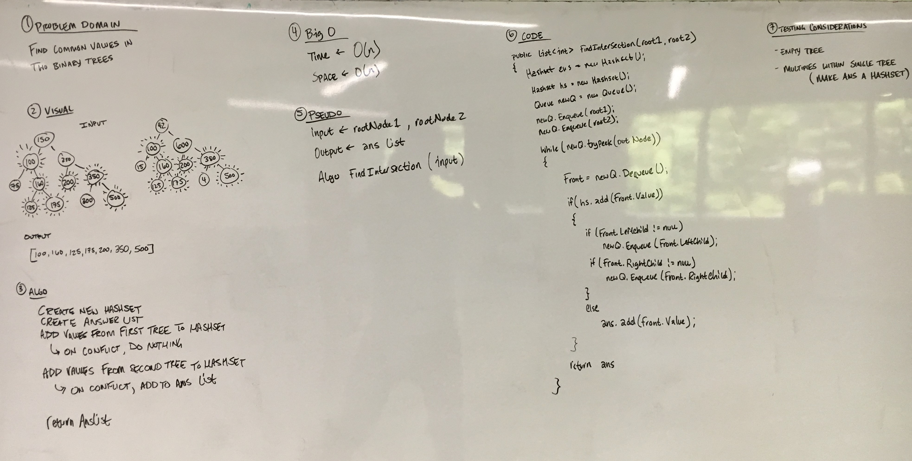

# Find Intersection

This challenge is an exercise in utilizing Hashtables and Hashsets to hash and
store data in an efficient way.

## Challenge

Write a function called tree_intersection that takes two binary tree parameters.
Without utilizing any of the built-in library methods available to your language,
return a set of values found in both trees.

## Solution

