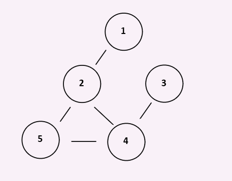

# Graphs

## What is a Graph?

A graph is a non-linear data structure that can be looked at as a collection of points made up of
vertices (or nodes), which are potentially connected by line segments called edges.

## What is it used for? Why?

Graphs can be used to represent networks with many-to-many connections. Examples can include city power circuits,
road systems, and social networking.

## Visual of what it looks like.

## Resources

[Wikipedia](https://en.wikipedia.org/wiki/Graph_(abstract_data_type))