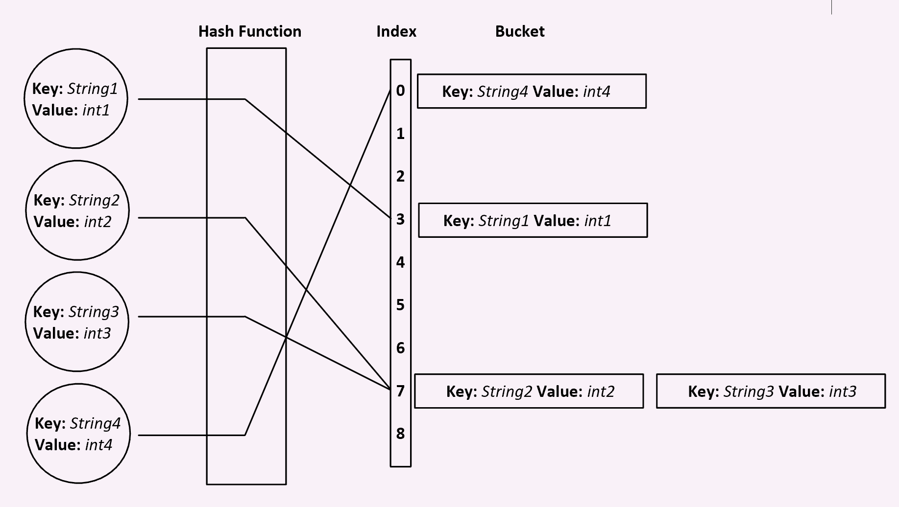

# Hashtables

## What is a Hashtable?

A hashtable is a data structure that implements an associative array abstract data type,
a structure that can map keys to values. 

A hash table uses a hash function to compute an index into an array of buckets or slots, from which the desired value can be found.

## What is it used for? Why?

In many situations, a hashtable can be more effiecient than a graph or tree. A well dimensioned hashtable
can have an average lookup speed independent of the number of elements in the table.

## Visual of what it looks like.

## Resources

[Wikipedia](https://en.wikipedia.org/wiki/Hash_table)