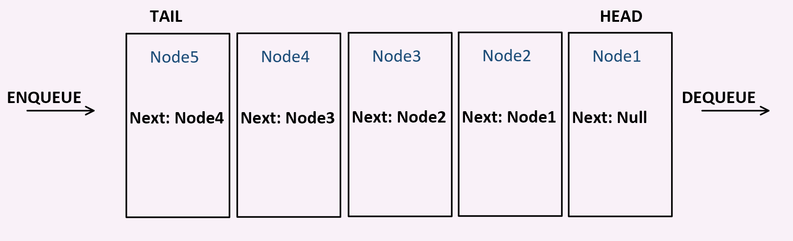

# Queues

## What is a Queue?

A queue is a linear data type that operates using the First-in-first-out principal.
A queue has two properties - a Head and a Tail.
The Enqueue() method adds a node to the Tail of the Queue.
The Dequeue() method removes a node from the Head of the Queue.

## What is it used for? Why?

Queues are best utilized when the First-in-first-out behavior is desired.

## Visual of what it looks like.

## Resources

[Wikipedia](https://en.wikipedia.org/wiki/Queue_(abstract_data_type))