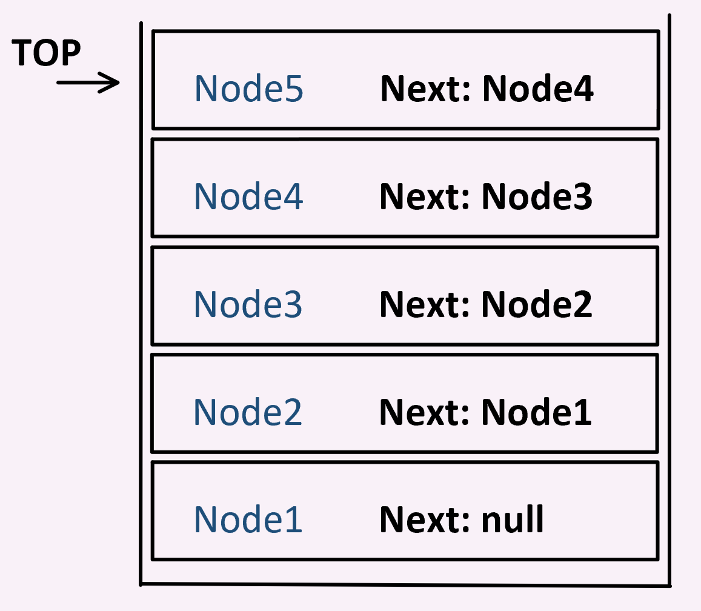

# Stacks

## What is a Stack?

A Stack is a linear data type which holds Nodes and operates using a 'Last-in-first-out'
ordering. A stack only has one property, the 'Top', which contains a referance to the top-most 
node in the stack. Pop() removes nodes from the top of the stack, while Push() adds a node to the
top of the stack.

## What is it used for? Why?

Stacks are best used when their List-in-first-out behavior is desired. An example of their use is in call stack memory
allocation, which allows the same memory allocation to be used when it becomes available.

## Visual of what it looks like.

## Resources

[Wikipedia](https://en.wikipedia.org/wiki/Stack_(abstract_data_type))