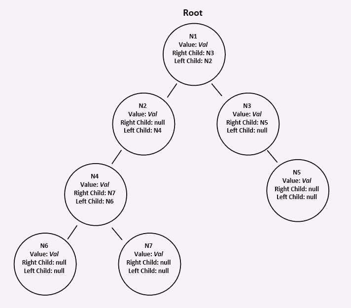

# Trees

## What is a Tree?

> A tree is a binary data structure in which each node is linked to *at most* two successor nodes.

## What is it used for? Why?

Trees can be very efficient for searching and sorting and also for presenting data.

## Visual of what it looks like.

## Resources

[Wikipedia](https://en.wikipedia.org/wiki/Binary_tree)
